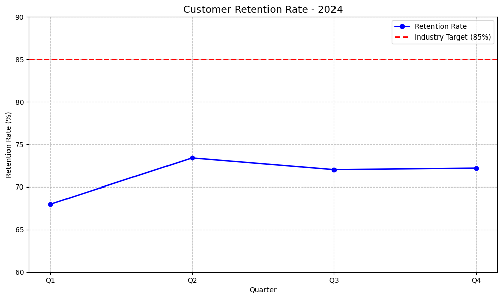

# 📊 Customer Retention Analysis - 2024

**Author**: Vaibhav Jangid  
**Email for verification**: 22f1000568@ds.study.iitm.ac.in

---

## 📈 Quarterly Retention Data

| Quarter | Retention Rate (%) |
|---------|---------------------|
| Q1      | 67.97               |
| Q2      | 73.43               |
| Q3      | 72.04               |
| Q4      | 72.22               |
| **Average** | **71.41**        |

**Industry Target**: 85%

---

## 🔍 Key Findings

- **Q1** had the lowest retention rate at **67.97%**, possibly due to a post-holiday churn or weak onboarding.
- There was a **noticeable improvement** in Q2 and Q3, but the rate plateaued in Q4 at **72.22%**.
- The **average retention rate of 71.41%** is significantly below the **industry target of 85%**.

---

## 💡 Business Implications

- Current retention efforts are **underperforming** compared to competitors.
- The retention plateau in Q3 and Q4 indicates that existing strategies may have **reached their limit**.
- Without proactive action, customer churn could lead to **revenue loss and reduced customer lifetime value (CLV)**.

---

## ✅ Recommendation

**Implement Targeted Retention Campaigns**:
- **Segment your customers** by behavior, engagement, or value.
- Launch **personalized loyalty programs** and re-engagement emails.
- Improve **customer onboarding experience** and regular touchpoints.
- Leverage **data analytics and AI** to predict churn and act early.
- Collect qualitative feedback through **surveys or interviews** to understand drop-off reasons.

---

## 📬 Contact

For queries or verification, reach out to:  
**22f1000568@ds.study.iitm.ac.in**

---
